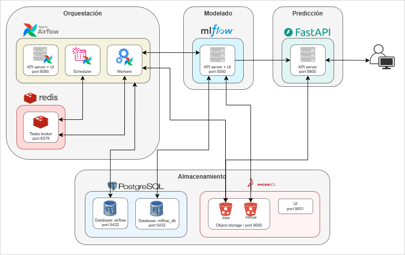

# Arquitectura del Proyecto - MLOps

```
>> Work in progress <<
```

Este documento describe los componentes principales de la plataforma y el flujo de trabajo que conecta orquestación, experimentación y modelado, almacenamiento y predicción.

La arquitectura se basa en cuatro pilares:
1. Orquestación (Airflow + Redis)
2. Modelado (MLflow)
3. Almacenamiento (PostgreSQL + MinIO)
4. Predicción (FastAPI)

## Diagrama de Arquitectura


## Componentes Principales

### Orquestación (Airflow + Redis)
**Apache Airflow**<br>
Motor responsable de planificar, ejecutar y monitorear los flujos de trabajo de Machine Learning (ETLs, entrenamiento, evaluación, despliegue, etc.).

Componentes clave:
- API server + UI (puerto 8080): interfaz para visualizar DAGs, runs y logs.
- Scheduler: decide qué tareas deben ejecutarse y cuándo.
- Workers (Celery Executor): ejecutan las tareas distribuidas.
- Base de datos airflow en PostgreSQL: almacena el estado de DAGs, tareas y configuraciones.

<br>

**Redis**<br>
Actúa como message broker cuando Airflow se ejecuta con el Celery Executor:
- Recibe las tareas publicadas por el Scheduler.
- Las distribuye a los workers encargados de ejecutarlas.
- Mantiene el estado intermedio de cada tarea (running, success, failed).
<br>
<br>

### Modelado (MLflow)<br>
**MLflow**<br>

Gestiona todo el ciclo de vida del modelo:
- Tracking de experimentos: parámetros, métricas, código y artefactos.
- Registro de modelos: versionado y promoción a etapas (Staging / Production).
- UI (puerto 5050): interfaz para visualizar experimentos, comparaciones y modelos.

MLflow se conecta a:
- Base de datos mlflow_db en PostgreSQL, donde almacena metadata.
- MinIO, donde guarda artefactos (modelos, datasets, gráficos, etc.).
<br>
<br>

### Almacenamiento (PostgreSQL + MinIO)
**PostgreSQL**<br>
El sistema maneja dos bases de datos:
- airflow (5432): almacén del estado de DAGs, tareas, usuarios, logs y configuraciones internas de Airflow.
- mlflow_db (5432): almacén de experimentos, runs, parámetros, métricas y metadata del model registry.

<br>

**MinIO (Object Storage)**<br>
Sistema de almacenamiento de objetos compatible con S3.

Usos principales:
- Almacenar artefactos generados por MLflow (modelos, imágenes, serializaciones).
- Servir modelos para la capa de predicción.
- GUI disponible en puerto 9001 para administración.
- El bucket expuesto en puerto 9000 es el endpoint de datos.
<br>
<br>

### Predicción (FastAPI)
**FastAPI**<br>
Se encarga de exponer una API de inferencia para que usuarios y aplicaciones externas consuman los modelos entrenados.

- Servidor API en puerto 8800.
- Carga modelos directamente desde MinIO o desde el registry de MLflow.
- Ofrece endpoints típicos como `/predict`, `/health`, `/model-info`
